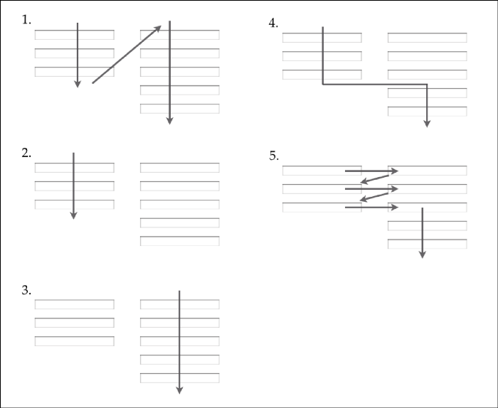
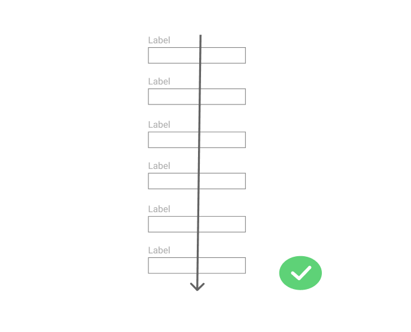
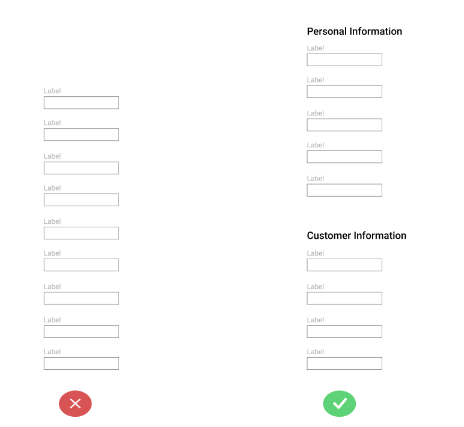
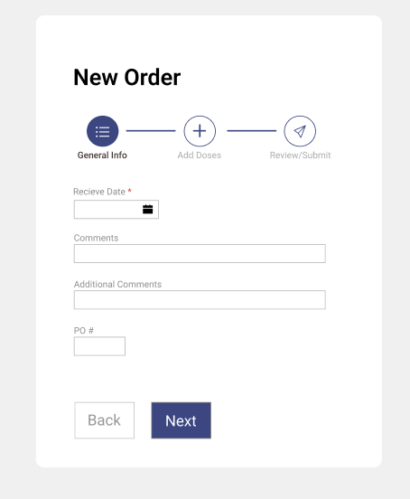
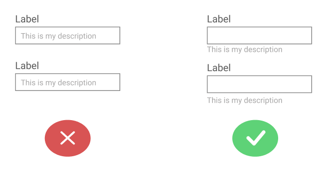
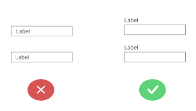
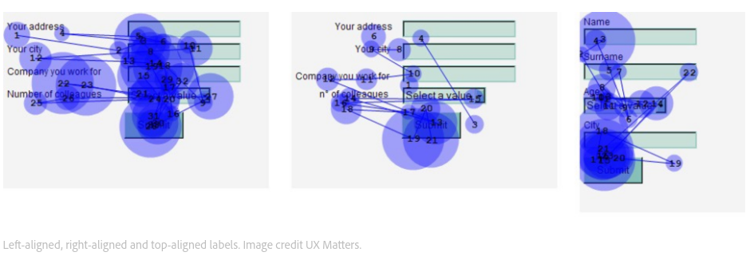
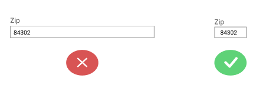
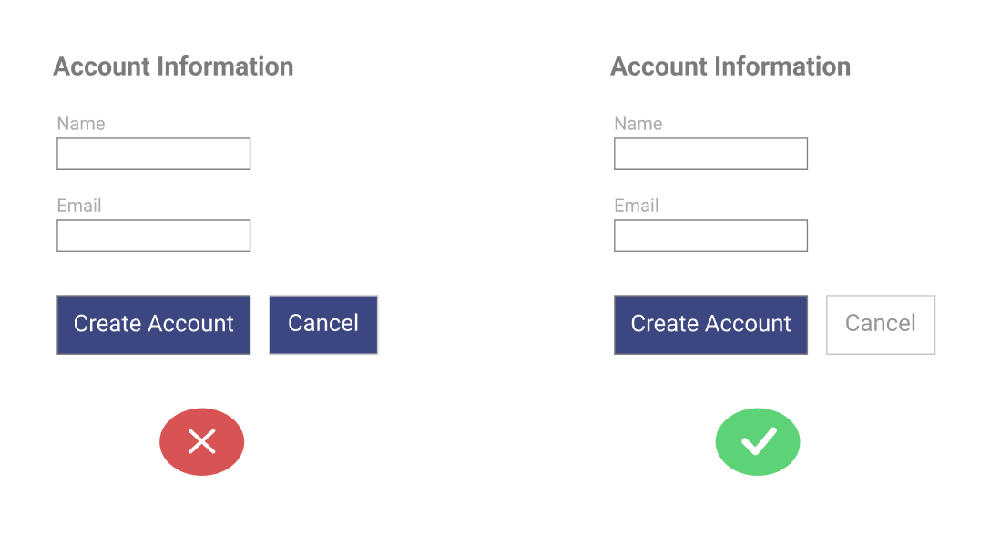

# UI/UX Notes

A place for me to dump all my things I am learning about UI/UX

## UX
### Forms
- Avoid multi-column forms
    - If a form has horizontally adjacent fields there are so many varying ways that the form can be interpreted. There is not a single understood way of completing the form and this can even cause users to lose confidence on whether all of the inputs need to be filled.
    
    - Single column forms have a very established and very clear path to completion that is well understood by most users.
    
- Break long forms into smaller pieces
    - When designing forms general rule of thumb is that the less fields the better. Less effort on the user or percieved less effort results in higher completion rate.
    - Displaying 5-7 inputs in a group is a good goal to aim for and is considered [common practice](https://xd.adobe.com/ideas/principles/web-design/best-practices-form-design/) 
    - A few different ideas for breaking up forms
      - Grouping forms into logical groupings. 
        - Breaking forms into smaller, logical groupings can not only increase user completion (by making a seemingly endless form feel more doable), but also give insight to the user as to why these fields are necessary.
        
        

      - Stepper (a more modern approach to a wizard)
        - This can make large forms feel more managable by breaking a large form into smaller, more managable tasks while giving them visual feedback on where they are at and what steps still need to be completed.
        - Studies show that providing the total amount of steps of front to the user increases form completion significantly.
        
        
        
- Placeholders
    - Avoid using placeholders as description for the input
    
        
        
        - Using placeholders as description is bad practice due to losing your description when you input anything.  
          - Instead place the description below the input, making sure to keep visual hierarchy
    - Avoid using placeholders as the input label
    
        
        
        - When using placeholder as label you lose the input label.
        - This can be okay if you are using floating placeholders (placeholder moves to label when there is input).
- Put labels above input.
    
    - Google’s UX researchers found that aligning labels above fields on the left-hand side increased form completion time. This is because it requires fewer ‘visual fixations’.
    - By placing the label above the input you can look at both the label and input without any additional effort.
- Input should be sized according to the size of the expected input
    
    - Having the input larger than the expected input makes users second guess what they are expected to input and lead to lower form completetion rates.
- Action Buttons
    - Avoid generic words on the button for example "Submit", instead use descriptive words for example "Create Account", "Place Order", etc.
    - 99% of the time it is the wrong choice to include reset buttons.
    - Primary vs Secondary actions
    
        
        
        - When there is no visual difference between the primary action and the secondary action this can both lead to confusion and increase rate of failure in a form. Secondary actions should draw less visual attention, this will reduce liklihood of accidental error and gives a more clear path to completetion.
- Validation
    - Validation is all over the place with implementation but the Reward early, punish late paradigm I tend to agree with the most
    - Reward early, punish late ["Inline Validation in Forms: Designing the Experience"](https://medium.com/wdstack/inline-validation-in-forms-designing-the-experience-123fb34088ce)
        - If field is empty or valid only show validations on leaving the input.
        - If field input was left at an invalid state and returned to, validate during input.
        - Implementation described in the article above looks like
            - The validation library must keep track of the dirty fields.
            - If the field was in a valid state, perform the validation on the blur event
            - If the field was in an invalid state, perform the validation when the field value is changed (using the combination of onchange, onblur and onkeypress events)
            - When the field goes from the invalid to valid state, treat it like a valid field
- Dynamic Forms
    - Hard to find anything concrete on this but when a form needs to (add another) these are the best (not great) discussions I have seen about it                   
        - [https://ux.stackexchange.com/questions/105724/another-pattern-for-dynamic-expanding-forms](https://ux.stackexchange.com/questions/105724/another-pattern-for-dynamic-expanding-forms)
      - [https://ux.stackexchange.com/questions/22004/dynamic-form-design](https://ux.stackexchange.com/questions/22004/dynamic-form-design)
- Sign up Form
    - Avoid second input for confirming password.
         - Asking for this a second time leads to lower user conversion and frustration.
         - Instead you should have a single input for password with a "Show Password" option for them to verify that they typed the password correctly.

### Type
- Font size
  - Body text 16px you can not go wrong with 
    - usually header should be around 2.5x the size of the body text (40px) in this case 
    - that should be 1rem vs 2.5rem
- Prefer smaller line height on larger text, increase line height on paragraphs to make more legible

## UI
- **Do not use high contrast borders** they draw unecessary attention from your eyes
    - using the law of proximity can aleviate a lot of the problems that borders are trying to solve.
    - using borders can be fine in some cases when they are low contrast
- Religious Debates 
    - People think everyone on the web thinks in the way that they do, if I dont like it nobody will 
    - You can sit and argue design decisions but the only thing that will really help is user testing
- The landing page should generally consist of a Hero Section which are made up of:
    - Headline
    - Sub-headline (optional)
    - Call to action
    - Usually some art or and illustration
### Mobile Design
- For margins we recommend keeping a safe zone of at least 20 pixels vertically free on each side (https://instapage.com/blog/mobile-landing-page-design)
